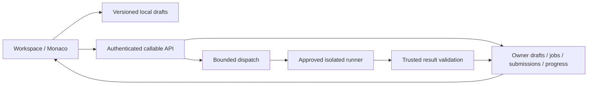

# WORKSPACE-E2E-001 v1 — Runnable coding workspace

Status: READY_FOR_REVIEW; implementation PENDING HUMAN APPROVAL.
Approval for PATHS-UI-001 does not authorize this new scope.

## Goal and evidence boundary

Deliver an independently authored practice workflow: open problem → restore draft → edit → run public/custom cases → inspect output → submit for trusted grading → read submission history → update verified progress. Use NeetCode as an experience reference, not an assertion of feature parity or permission to reproduce its content. No pretend verdicts, fabricated benchmark numbers, or reference inventory labeled runnable.

Repository Intelligence: DEGRADED. CodeGraph stale/healthy, CocoIndex stale/unhealthy; incremental refresh attempted once. Bound claims to source and tests. Repository no current commit; application files untracked. Preserve unrelated WIP and snapshot the candidate before changes. Approval validator READY-only conflicts with policy's explicit DEGRADED fallback; document instead of changing governance to self-authorize.

## Verified current state

- ReferenceProblem.tsx handles contains-duplicate and metadata-only references. Run/Submit/Hint all call unavailable(); source only in React state. Four editing languages; changing language replaces draft. Route changes are not explicitly keyed/reset. Solution/history/discussion are placeholders.
- Practice.tsx has a separate workspace for peak-requests. Owner Firestore draft save uses revision transaction; no autosave. Run and Submit share an unavailable callable. Loading/save failure recovery and success handling need review.
- CodeEditor.tsx lazy-loaded by callers but imports Monaco broadly; fixed 420px height, default theme and no problem/language model path. Worker resource lifecycle and bundle costs need measurement.
- functions/src/index.ts createSubmission always rejects. Learner callables reject outside emulator, preserving production boundary. No approved runner or trusted verdict persistence.
- packages/domain/src/execution.ts defines provider and job transitions, no usable adapter. No browser eval/server child process/public demo fallback allowed.
- Firestore drafts rules only permit peak-requests-v1. Progress server-only. Submission collections/rules/history not implemented.
- content/original/duplicate-check.ts independently authored, preview not content-approved. 450 references are metadata, not 450 authored/tested problems.
- tests cover UI tabs/unavailable messages, owner draft emulator save, contracts and trusted reference functions. Those do not execute submitted code in a sandbox.
- docs/provider-readiness.md contains historical deployed Firebase/billing-off notes. Live provider state NOT VERIFIED this task. Real Google auth, App Check, execution and external spend remain separate acceptance gates.

## Recommended architecture

Keep React/Vite + Firebase; use a shared workspace model and execution-provider boundary. Separate trusted API/orchestration/comparison from isolated untrusted execution. Do not add infrastructure solely for theoretical scale.

Guest local drafts and optional approved public-case execution never count as verified progress. Cloud sync and submissions require authenticated learner, object ownership, quota and environment policy. Provider keys never enter browser. Hidden cases/expected outputs remain trusted-side only and cannot be exposed by source bundles or candidate diagnostics.

## Visual and interaction contract

Preview: docs/design/coding-workspace-preview.html. Interaction design only; no execution/persistence claims.

Compact workspace topbar, clear problem title/difficulty/topic, independent pane scrolling, balanced split and drag divider with keyboard alternative. Editor fills actual available height; no dead space caused by 420px constraint. Desktop: two panes and resizable result tray. Mobile: Problem / Code / Results navigation, no page-wide overflow; keep Run/Submit reachable above safe-area and keyboard. Problem descriptions use concise authored text, compact examples; preview/review status remains visible without multiple warnings.

Keep functional Problem, Solution, Submissions tabs; remove Discuss until a real moderated flow exists. Reviewed authored explanations and progressive hints only. Unauthored references link to source and do not advertise runnable grading. Toolbar: actual language support, save state, reset with recoverable backup, expand/collapse with correct labels. Keyboard shortcuts announced and conflict-safe. Language switch restores independent per-language drafts. Route/account changes isolate drafts, tabs, requests and editor models. Loading, failure and fallback textarea remain usable.

Motion intensity: low and functional, proposed for approval. Tab indicator opacity/color 120ms, result feedback opacity 160ms, no animation during pane dragging, no simulated typing/progress. Do not animate editor text or delay controls. Reduced motion removes transitions. Repeated clicks/cancellation/unmount must not duplicate jobs or leave timers/listeners.

## Delivery batches and exact ownership surfaces

### A — Shared workspace, persistence and UX
- apps/web/src/features/ReferenceProblem.tsx, Practice.tsx: share authored/reference policy and UI; remove duplicated workflow and deceptive controls within this scope.
- apps/web/src/features/CodeEditor.tsx: model path per problem revision/language, responsive height, actual theme, cleanup and keyboard/textarea fallback.
- New apps/web/src/features/workspace/*: workspace controller, problem panel, execution/result panel, submission panel and draft hooks. Keep state machine separate from presentation.
- apps/web/src/styles.css: workspace-only responsive, dark, focus and motion rules; no global redesign.
- packages/contracts/src/index.ts: validated problem/language/revision/draft/run/submit/status contracts; bounds, strict schemas and explicit availability.
- Draft local key: user-or-guest namespace + problem revision + language; safe hydration before editing/autosave. Debounce 750ms proposed; flush safely, storage-full/offline error preserves editable buffer. Local save != cloud sync. Cloud revision/CAS conflicts preserve both snapshots and offer explicit resolution; no silent overwrite. Bounded storage and no cross-account leakage.

Acceptance: refresh/language/problem switch preserves correct draft; account changes do not reveal prior user; failed saves preserve code; drag/keyboard/mobile/dark/zoom/reduced-motion work. No runnable claims before batch B.

### B — Execution contracts and isolated runner integration
- packages/domain/src/execution.ts and new execution modules: job state machine, immutable source hash, problem/test/runtime revisions, custom-case validation, monotonic transitions.
- functions/src/index.ts and new functions/src/execution/*: createRun/createSubmission/getJob/cancel, authenticated ownership, quota reservation, transactional idempotency, bounded dispatch/reconciliation.
- New runner adapter and local runner harness under services/runner/* plus docs/adr/*: concrete isolation adapter only after provider/security decision. Never execute submitted code in Functions, browser, developer shell, CI host or ordinary trusted process.
- Language runtime choices Python/JS/TS/Java are goals; UI enables only verified runtime IDs. Pinned versions and compile behavior reviewed; custom cases available only where parser/wrapper is implemented.
- Run uses public/custom cases; Submit uses server-owned hidden suites. Pure deterministic wrapper/comparison for each problem, timeout/memory/output bounds. Return explicit compile/runtime/wrong-answer/infrastructure states; unknown provider receipt reconciled, not blindly resubmitted.
- Limits proposed for initial approved runner validation: 100KB source, 2s candidate CPU/5s wall, 256MiB memory, 64KiB public diagnostic output, network denied, process/filesystem bounds. Final limits per runtime measured before activation; Java startup not forced into unverified budget. Cancel requests may race completion; trusted terminal state reconciled, not assumed cancelled.
- Authenticated callbacks or owned bounded polling; replay/forged verdict defenses; sourceHash/user/job/revision binding. Trusted grader must not expose hidden inputs, expected output or raw hidden stdout/stderr. Cleanup and cross-job isolation tested.

Acceptance: execute candidate correct and incorrect code; compile error, exception, loop, flood, resource abuse, forged callback, duplicate Submit, late completion, outages and cancel. Mocks prove orchestration only. Sandbox assurance requires actual isolated execution evidence.

### C — Database/history/progress
- firestore.rules, firestore.indexes.json: owner draft reads/writes for published allowed problem revisions; immutable owner timestamps/schema/revision validation. User writes never create/modify verdicts, submissions or progress.
- Proposed users/{uid}/drafts/{revision-language-context}, executionJobs/{jobId} server-only with sanitized owner projection, users/{uid}/submissions/{id}, users/{uid}/progress/{problemRevision}. No globally readable code; hidden-bank paths server-only.
- Submissions snapshot source/runtime/content/test revisions; cursor-paginated history, bounded subscriptions and sanitized diagnostics. Terminal result + progress update atomic/idempotent. ACCEPTED Submit only counts; Run/preview/unverified result never marks solved.
- Test expiry/retention and source deletion policy before production; TTL is eventual, never an authorization mechanism. Index deployment reviewed separately. Preserve existing owner rules and old drafts; migration compatibility and rollback documented.
- app Progress/roadmap/bookmark consumers touched only where verified graded progress replaces absent data. No fake rating or performance percentile.

Acceptance: emulator cross-user denial, unauthenticated denial, forged verdict denial, protected hidden suite, CAS collisions, retries, history pagination, reload readback and exactly-once progress.

### D — Performance and release evidence
- Measure editor startup/chunks, route switching, worker/model counts, layout responsiveness and sustained subscriptions against exact candidate; targeted Monaco imports/lazy split only after evidence.
- Proposed lab budgets, not achieved values: workspace chrome interactive ≤1s warm; editor ready ≤2.5s cold under fixed desktop/network fixture; UI response p95 <100ms excluding network; no growing model/worker/listener count after 50 route/language cycles. Test definition and hardware captured. Runner queue/compile/execute measured separately.
- Bounded Firestore reads, pagination, unsubscribe cleanup, adaptive job updates and polling backoff. No per-keystroke cloud write. No expensive full catalog download on problem route.
- Operational signals: request/job correlation without source/PII in logs; queue age, provider errors, execution latency, cancellation/timeout count and quota denials. Source-free diagnostics; no fabricated percentiles.
- tests/unit, tests/rules, tests/e2e plus isolated runner threat fixtures; meaningful coverage for loss of work, races and trust boundaries. Update obsolete unavailable assertions after approved behavior changes.
- docs/evidence, docs/code-execution-security.md, docs/provider-readiness.md: current exact evidence and environment classification. Product-content/animation/final-review reports required.

## Proposed scope and boundaries

Approve A–D for local code, tests, docs and emulator work, including new internal modules/contracts and scoped rules changes described above. No permission inferred for billing, paid API calls, provider secrets, deployment, live DB writes, publication, DNS/IAM, schema deletion or account operations. Existing security policy remains intact. No broader homepage/UI refactor, AI chat, multiplayer collaboration, ratings, payment, complete 450-problem content creation or discussion platform.

At least Contains Duplicate and existing peak-requests become authored vertical slices; preserve other references honestly. Content publication requires actual reviewed authored statements/tests/solutions. Scale out catalog only after these slices pass end to end.

## External dependency decision

Recommended: keep provider-neutral integration and fail-closed unavailable capability until an isolated runner target is approved. Local implementation/testing can proceed after plan approval; real execution cannot be called complete without runner access and measured hostile-code evidence. Need a chosen self-hosted/managed isolated runner, allowed environment, runtime versions, retention, region and spend ceiling before installing/provisioning or sending real execution requests. Current local source contains no approved provider; do not invent one. Budget/capacity/cost UNAVAILABLE; traffic targets unknown. No architecture parity or production-ready claim.

## Verification and governance

Select universal, TS/JS, frontend HTML/CSS, web, API, database, concurrency, memory, security, visual-design, product-content, animation-motion profiles. Repeat review → approved fixes → verification → review; bind logs/screenshots to candidate snapshot when no commit exists. Required test phases: unit/contracts, owner-negative Rules emulator, actual authored browser flow, isolated runner adversarial suite, runtime version/readback, staging auth/App Check, load/performance fixture and release rollback.

Product-content review design status: BLOCKED until current in-context keyboard/locale/zoom/state evidence. Inventory toolbar, tabs, status, result meanings and availability before implementation. Purpose=complete practice loop; Agency=restore/cancel/resize/reset control; Responsibility=accurate run vs grade vs sync; Familiarity=native keyboard/links; Flexibility=mobile/textarea/locale; Simplicity=three useful panels; Craft=all failure/loading states; Delight=responsive calm feedback. These are proposed checks, not current PASS.

No application implementation made in this planning task. Plan review: source-grounded within scope; NeetCode webpage rendered content unavailable via text fetch, so detailed parity claims NOT VERIFIED. Architecture status READY_FOR_REVIEW. Production readiness NOT_READY. Token usage/cost Unavailable. Memory candidates None.
